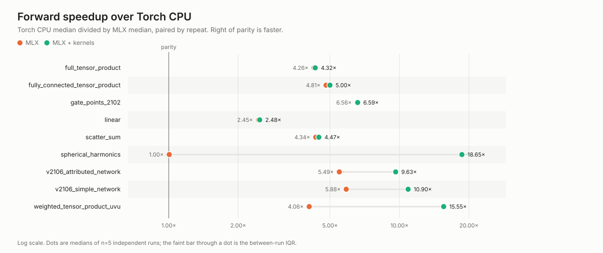
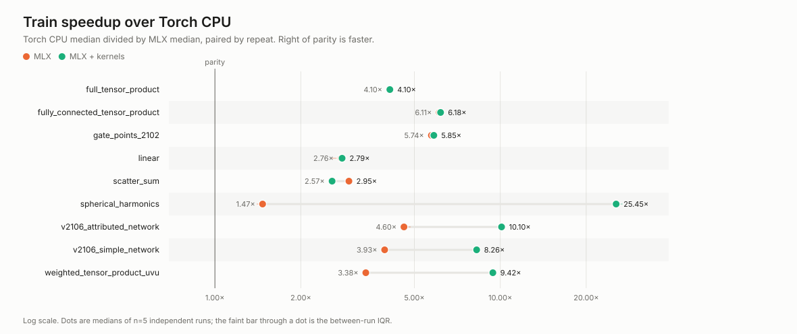

# Performance and automatic differentiation

MLX work is lazy and asynchronous with respect to the CPU. Correct benchmarks
must materialize outputs before stopping the timer:

```python
start = time.perf_counter()
output = model(inputs)
mx.eval(output)
elapsed = time.perf_counter() - start
```

Run warm-up iterations before sampling so compilation and kernel caching are
not counted as steady-state inference. The repository's `evals/` harness does
this consistently across Torch CPU, general MLX, and kernel-enabled MLX.

## Generated Metal kernels

Tensor products, spherical harmonics, and scatter aggregation can use generated
Metal kernels. Dispatch is automatic: compatible kernels fuse indexing,
Clebsch–Gordan contraction, weighting, and accumulation; the general MLX path
handles unsupported inputs and performance crossover points.

Dense shared-weight tensor products deliberately keep their parameter vector
compact. Expanding a shared vector across the batch produces the same forward
values but creates a large per-item weight-gradient reduction. The compact
execution is used by FullyConnectedTensorProduct and by general shared-weight
TensorProduct instructions in every connection mode.

Set `use_custom_kernel=False` to compare paths or to request the most general
automatic-differentiation behavior. Disabling a kernel changes execution, not
the mathematical operation.

## Measured speedups

Both figures below plot **Torch CPU median / MLX median**, so a point to the
right of the parity rule means MLX is faster. Each row is one benchmark case,
and it carries **two points**:

- **orange — MLX**: compiled MLX with generated kernels disabled.
- **aqua — MLX + kernels**: the same work with kernel dispatch enabled.

The gap between the two points is therefore the kernel contribution, and the
distance from the parity rule is the total gain over Torch CPU. A row whose two
points sit on top of each other gained nothing from a kernel.





### What each row measures

| Row | Operation | Kernel path taken |
| --- | --- | --- |
| `spherical_harmonics` | Real spherical harmonics of every edge vector — the geometry encoding a point model evaluates most often | `metal-spherical-harmonics` |
| `weighted_tensor_product_uvu` | Per-item learned `uvu` contraction, the tensor product message passing actually runs per edge | `metal-channel-uvu` |
| `scatter_sum` | Aggregation of edge messages onto nodes | `metal-scatter-sum` |
| `full_tensor_product` | Every unweighted Clebsch–Gordan output path | falls back to general MLX |
| `fully_connected_tensor_product` | Dense learned equivariant mixing across all paths | falls back to general MLX |
| `linear` | Equivariant multiplicity mixing. Deliberately a control: it has no kernel, so the two points must coincide | no kernel exists |
| `gate_points_2102` | The full February 2021 gated point network | model has no kernel toggle |
| `v2106_simple_network` | v2106 geometric message-passing network, end to end | `mixed-model-kernels` |
| `v2106_attributed_network` | v2106 with node and edge attributes, end to end | `mixed-model-kernels` |

Read the two columns of points separately. Orange shows what MLX gives you for
free — roughly 2.5–6x across the board, and near parity for
`spherical_harmonics`, where general MLX is no faster than Torch eager. Aqua
shows where a generated kernel then adds something: `spherical_harmonics` goes
from parity to about 19x, and `weighted_tensor_product_uvu` from 4x to 16x.
Where the two coincide — `linear`, `full_tensor_product`, `gate_points_2102` —
the gain is MLX's, not a kernel's.

`mixed-model-kernels` on the two end-to-end networks means kernel-aware
submodules are enabled, not that every operation inside the model uses a
generated kernel.

### Why forward and training differ

The training figure is not a second measurement of the forward pass: it is
forward **plus** backward, and the two phases have different ratios. Taking
`spherical_harmonics` from the run plotted above:

| | forward | backward (train − forward) |
| --- | --- | --- |
| Torch CPU | 8.87 ms | 20.36 ms |
| MLX + kernels | 0.45 ms | 0.65 ms |
| ratio | 19.9x | 31.4x |

Torch's autograd for spherical harmonics costs 2.3x its own forward pass, while
the kernel's backward costs 1.5x its forward. The training number is the blend
of the two phases weighted by MLX's time in each, which is why it lands at
about 25x — between the forward and backward ratios, nearer the backward one
because backward dominates the total.

This also means a row can move in either direction between the two figures.
`scatter_sum` drops from 4.5x to 2.6x because its backward is comparatively
cheap for Torch, while `spherical_harmonics` rises for the opposite reason.

### Regenerating these figures

```bash
.venv/bin/python evals/run.py --preset full
cp evals/results/<timestamp>/plots/speedup_*.svg docs/_static/
```

The numbers quoted here come from one five-repeat run on one machine; treat
them as the shape of the result, not as a specification. Each point is the
median of the paired per-repeat ratios, so a single slow repeat does not move
it.

## Kernel limitations

Kernel-enabled execution is an adaptive policy, not a promise that every
operation uses a custom kernel. Unsupported shapes and measured crossover
points fall back to general MLX without changing results. Benchmark reports
record the selected path so a fallback is not reported as kernel execution.

- Generated kernels require Apple Silicon with Metal and currently operate on
  `float32`. Other devices and dtypes use general MLX.
- Tensor-product kernels require rank-two inputs with equal batch size.
  Weighted calls additionally require the exact supported shared rank-one or
  unshared per-item rank-two weight layout.
- Sparse scalar-path tensor products are capped at 2,000,000 generated terms,
  a batch size of 512, and 2,000,000 batch-times-path terms. Above these
  crossover guards, batched general MLX contractions are faster and are
  selected automatically. Dense shared-weight
  `FullyConnectedTensorProduct` therefore normally uses general MLX.
- The channel-local kernel is specialized for weighted `uvu` instructions
  with unique output blocks, uniform channel multiplicity, and unshared
  per-item weights. It is the important large-edge-count message-passing
  specialization; other connection modes use scalar-path kernels or general
  MLX.
- The generated spherical-harmonic kernel accepts nonempty rank-two
  `float32` vectors through `l=4`. Higher degrees, empty inputs, and additional
  leading dimensions use the general recurrence.
- Generated scatter accepts nonempty rank-two-or-higher `float32` sources and
  eager, valid indices. Its atomic accumulation can be slower than MLX
  indexed-add for some shapes, so it is opt-in and should be benchmarked for
  the target graph.
- Kernels currently operate on individual primitives. Message tensor
  products, radial weighting, and scatter are not fused into one graph-level
  dispatch, so intermediate message arrays still consume memory.

The shipped `gate_points_2102` model currently has no model-level kernel
toggle and always uses its general MLX tensor-product and scatter paths. The
v2106 models propagate the toggle, but remain mixed executions because dense
and unsupported operations fall back automatically.

Compilation and generated-kernel startup are reported separately by the
evaluation suite and excluded from steady-state latency. For short-lived or
small workloads, startup can outweigh the steady-state gain.

## Differentiation boundary

Reverse-mode gradients and reverse-over-reverse second derivatives are
supported by generated kernels. MLX cannot currently apply JVP directly to a
`CustomKernel` primitive. JVP users—Hessian-vector products, phonons,
directional response, tangent dynamics, and forward-mode sensitivity—should
use the general path:

```python
output = tensor_product.differentiable_arrays(left, right, weights)
harmonics = o3.spherical_harmonics(
    degrees, vectors, use_custom_kernel=False
)
```

For graph reduction, use
`scatter_sum(..., use_custom_kernel=False, jvp_safe=True)`. MLX 0.31's
indexed-add primitive does not implement JVP, so this fixed-index fallback uses
a sparse sorted prefix sum with linear memory. Ordinary scatter calls retain
the faster indexed-add implementation.

See the repository's
[evaluation guide](https://github.com/lamalab-org/e3nn_mlx/blob/main/evals/README.md)
for the compact three-way benchmark and randomized numerical parity suites.
