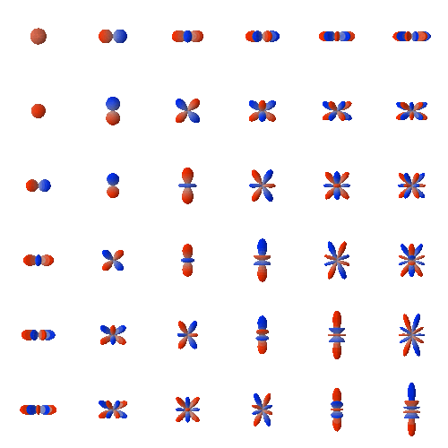

# e3nn-mlx

`e3nn-mlx` is an MLX-native implementation of Euclidean neural-network
building blocks for Apple silicon. It keeps the familiar `e3nn.o3` and
`e3nn.nn` organization while using MLX arrays, compilation, automatic
differentiation, and generated Metal kernels.

```{important}
This project is an independent MLX port and is currently alpha software. It is
not a drop-in binary replacement for PyTorch e3nn. Consult the
[compatibility and numerical conventions](COMPATIBILITY.md) before depending on an operation
that is not covered by the public API below.
```




This animation contains all 36 real spherical-harmonic components through
degree $l=5$. The surfaces are evaluated by
{func}`e3nn_mlx.o3.spherical_harmonics`; the visualization converts the modern
torch-compatible basis into the legacy display convention used by the
[original e3nn animation](https://e3nn.org/assets/img/sphharm.gif). 

This animation an be rebuild with 
```bash
.venv/bin/python tutorials/spherical_harmonics_animation.py \

```


## Where to start

- New to equivariance? Read [Irreducible representations](guide/irreps.md),
  then work through the [first equivariant operation](examples/getting_started.md).
- Prefer notebook-based introductions? Explore the
  [adapted historical e3nn tutorials](https://github.com/lamalab-org/e3nn_mlx/tree/main/tutorials)
  on tensor types, spherical-tensor operations, and invariant atomic
  descriptors.
- Coming from e3nn/PyTorch? Start with the [migration guide](guide/migration.md).
- Building a model? See [tensor products](guide/tensor_products.md), the
  [convolution example](examples/convolution.md), and [point models](examples/point_models.md).
- Optimizing Apple-silicon workloads? Read
  [performance and differentiation](guide/performance.md).

## A minimal example

```python
import mlx.core as mx
from e3nn_mlx import o3

irreps = o3.Irreps("4x0e + 2x1o")
linear = o3.Linear(irreps, "8x0e + 4x1o")
x = mx.random.normal((128, irreps.dim))
y = linear(x)
mx.eval(y)

assert y.shape == (128, linear.irreps_out.dim)
```

The scalar (`0e`) and vector (`1o`) channels are mixed only in ways compatible
with their transformation laws. The same operation accepts an
{class}`~e3nn_mlx.IrrepsArray` when representation-aware values are useful.

```{toctree}
:hidden:
:maxdepth: 2

guide/index
examples/index
api/index
development/index
```
